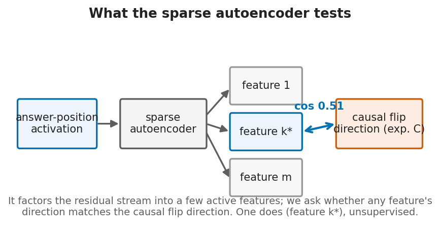
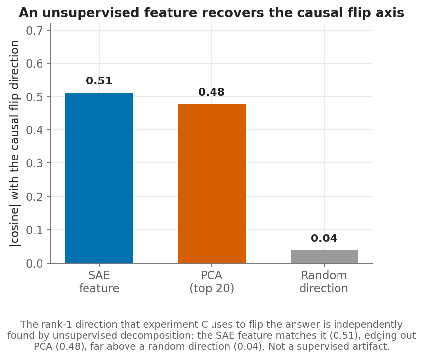
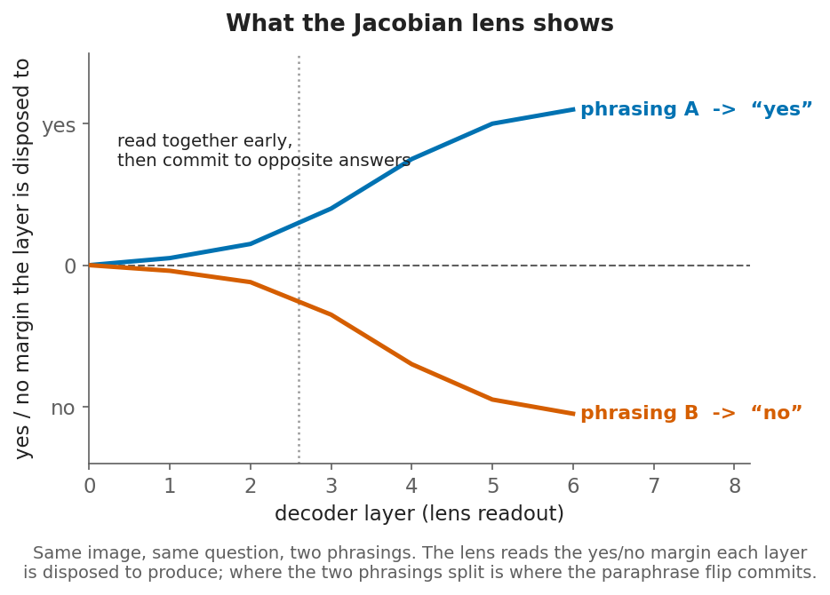
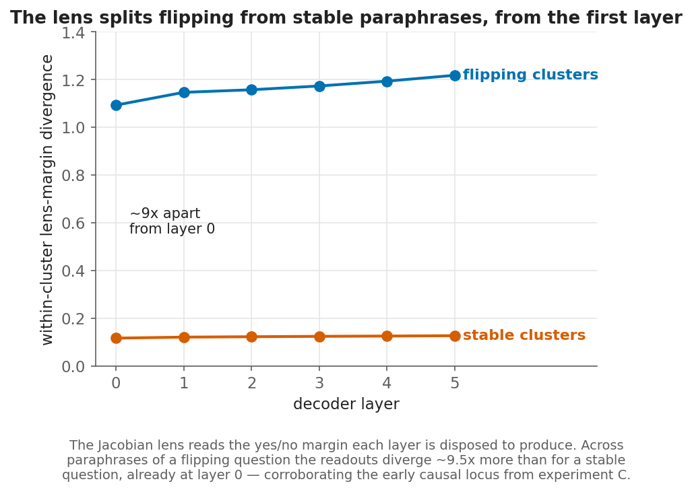
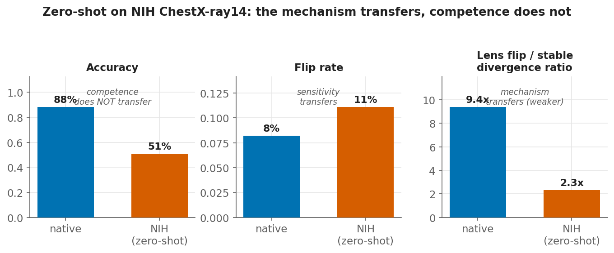

# What the experiments prove

A plain read of the baby-MedGemma study: the framework, each experiment in order,
the numbers, and where the claims stop. All figures are baby-Gemma over 16 seeds
unless noted (`results_gemma/`).

## The question

Medical vision-language models often change their yes/no answer when a clinical
question is rephrased without changing its meaning. On a deployed model you can
find *where* that flip is decided and *what* feature carries it, but not *why* it
exists, because the model's data, architecture, and objective are frozen together.
To ask *why*, you have to intervene on one of them and read the effect.

## The probe

A **frozen `google/medsiglip-448` encoder** (429M, the SigLIP family MedGemma
uses) feeds a small **Gemma-3 decoder** (13.9M trainable parameters: rotary
position embeddings, RMSNorm, grouped-query attention with 6 query and 2
key-value heads), with the 256 image tokens prepended inline and read by the same
causally-masked decoder. It is trained on 1,841 binary presence questions over
1,775 chest radiographs (MIMIC-CXR 980, PadChest 861), each carrying
register-tagged paraphrases; it reaches 88.8% accuracy and is text-reliant like
MedGemma (75% of answers unchanged when the image is removed, vs the deployed
model's 81%). Two properties make it useful:

1. **Language-side by construction.** The encoder returns *identical* features for
   every paraphrase, so any answer that changes across paraphrases is in the
   decoder, not the image. Guaranteed by the setup, not measured.
2. **The origin is a knob.** We can vary the training-phrasing distribution with
   everything else held fixed, turning a difference in the flip rate into an
   *identified cause*.

## The framework: five experiments, A to E

The five experiments isolate the origin in one line each:

| | Experiment | Question it answers |
|---|---|---|
| **A** | Data provenance | Does the *training data* cause the sensitivity? |
| **B** | Divergence trajectory | *Where* in the network does the disagreement emerge? |
| **C** | Causal patching | *What* decides the flip, and is it low-rank? |
| **D** | Architecture | Is it a property of model *depth*? |
| **E** | Grounding | Is it caused by *weak image grounding*? |

A establishes the cause; B and C localize and confirm the mechanism; D and E rule
out the two obvious alternatives. Two corroborations (an unsupervised feature and
a lens) and a zero-shot transfer test close it out.

---

## A. The cause: data provenance

**What we did.** Train the same probe under three phrasing regimes that differ
*only* in the questions it sees: *canonical* (one fixed phrasing), *augmented*
(every paraphrase), and *adversarial* (register tied to the answer). Because only
the training-phrasing distribution changes, a difference in the flip rate is an
identified cause.

**Result.**

| Regime | Trained on | Flip rate |
|---|---|---|
| Augmented | every paraphrase | **8.4%** |
| Canonical | one fixed phrasing | 30.3% |
| Adversarial | register tied to the answer | 30.4% |

Augmented separates from both narrow regimes at the maximum effect size
(Mann-Whitney U p = 1.4e-6, Cliff's delta = 1.00: every augmented seed flips less
than every seed of the other two). The two narrow regimes are indistinguishable
from each other (p = 0.62).

**What it proves.** The training-phrasing distribution is *sufficient* to produce
and to remove paraphrase sensitivity, and broad coverage is the single largest
lever against it. Correlating register with the answer adds nothing beyond a
single phrasing, so the reproducible finding is the augmentation lever, not a
taxonomy of flip types.

## B. Where it emerges: divergence trajectory

**What we did.** Measure within-cluster representation dispersion at each layer
and correlate it with whether the cluster flips.

**Result.** Dispersion couples to the flip from the earliest layers (point-biserial
near 0.64 at the input for natural flips, near 0.90 throughout for adversarial),
as expected of a Gemma-3 decoder whose rotary encoding separates paraphrases
before the stack. Lexical substitution drives the most naturally occurring flips.

**What it proves.** The disagreement is present early and is carried by the
wording, not seeded in the image.

## C. The mechanism: causal patching

**What we did.** For a flipped question, transplant the answer position along a
single rank-1 direction (the difference between a phrasing answered one way and
one answered the other) at one layer at a time.

**Result.** It restores the flipped answer with net recovery near 1.0 across the
early layers (decision locus at layers 0 to 1), while a norm-matched random
direction and a non-flip-cluster control leave the answer unchanged (disruption
0.000). This holds for the *naturally occurring* flips of the augmented regime
(18.8 per seed), not only the injected adversarial ones (59.7 per seed).

**What it proves.** The flip is a low-rank, language-side, readout-stage
direction, decided in the early layers, and not an artifact of the adversarial
construction.

## D. Ruling out architecture

**What we did.** Sweep the decoder depth: 2, 4, 6, 8 layers.

**Result.** The flip rate stays within 7.6% to 9.4% at constant accuracy.

**What it proves.** Depth is not the driver; the effect is not a byproduct of
model capacity.

## E. Ruling out weak grounding

**What we did.** Weaken the visual pathway by dropping a fraction of the vision
tokens during training, and sweep that fraction.

**Result.** The flip-rate curve is non-monotonic (moderate dropout acts as
regularization and lowers it; only near-total dropout raises it).

**What it proves.** Nothing clean. This is reported as inconclusive; no
weak-grounding claim is drawn from it.

---

## Corroboration: an unsupervised feature, and a lens

Two independent methods that make different assumptions agree with C.

**A sparse autoencoder (`sae.py`).** A sparse autoencoder factors the residual
stream at the answer position into a few active features, each a direction; we ask
whether any feature's direction matches the causal flip direction from C.

An unsupervised feature aligns with the causal flip direction at |cosine| 0.51,
edging out PCA's 0.48 and far above a random direction's 0.04; a distinct feature
predicts flips (point-biserial 0.37). So the flip axis is unsupervised-recoverable,
not an artifact of the supervised difference-of-means, though it is not a single
sharp gate.

**A Jacobian lens (`jlens.py`).** The lens reads the yes/no margin each layer is
disposed to produce (the average input-output Jacobian). For two phrasings of one
question the readouts track together early, then commit to opposite answers.

Across paraphrases, flipping clusters diverge about **9.5x** more than stable ones,
from layer 0, with a divergence-vs-flip correlation of **0.71**. A lens and a
causal patch, with different assumptions, place the flip in the same early layers.

## Extension: zero-shot transfer to NIH (`nih_demo.py`)

baby-Gemma, trained only on MIMIC and PadChest, answering questions about 2,227
**NIH ChestX-ray14** radiographs it has never seen (all 14 findings in-vocabulary,
3,004 clusters), through the frozen encoder:

| Measure | NIH (zero-shot) | Native |
|---|---|---|
| Accuracy | 0.506 (chance) | 0.882 |
| Flip rate | 0.111 | 0.082 |
| Lens flip/non-flip divergence ratio | ~2.0x | ~9.5x |

The paraphrase-sensitivity *mechanism* transfers: on unseen radiographs the model
still flips at a realistic rate and the lens still separates flipping clusters
from stable ones. The model's *competence* does not (chance accuracy on NIH), so
these are flips of an out-of-distribution model, which is why the signal is
weaker. Paraphrase sensitivity is a property of how the model reads the wording,
so it shows up even when the model is out of its depth on the images.

---

## The claim, stated exactly

The origin of paraphrase sensitivity is the **training-phrasing distribution**,
executed as a **low-rank direction in the early language layers** that read a
fixed visual representation. The fix follows: paraphrase augmentation is the lever
(30.3% down to 8.4%), and a targeted low-rank edit at those layers is the
efficient parametric fix, which is why a layers-15-to-19 low-rank adaptation
reduces flips on the deployed model while full fine-tuning does not.

## What this does NOT prove

- **It is a controlled probe, not the deployed model.** The result is a
  *sufficiency* claim plus a localization, not proof that MedGemma-4B's paraphrase
  sensitivity has this exact origin. Its absolute layer index (early, near layer
  0-1) is not comparable to the deployed model's layer-16 commit; only the
  qualitative account transfers.
- **It manipulates adaptation-stage data, not pretraining provenance.**
- **It grounds weakly (like MedGemma),** so it speaks to *where* the flip is
  decided and *why* it is learnable, not to image use; experiment E was
  inconclusive.
- **The coverage-vs-shortcut distinction did not reproduce** (A: the two narrow
  regimes are statistically indistinguishable).
- **It is a narrow model, not a medical VQA system,** with a 733-word
  domain-specific vocabulary, loadable and runnable for inspection and
  reproduction only. Not for clinical use.

## Why it still matters: triangulation

The probe is one leg of a three-method argument that no single method licenses. On
MedGemma-4B, a lens-free residual patch and the Jacobian lens put the answer
commit at layer 16, and a GemmaScope sparse autoencoder finds a layer-17 register
gate (Feature 3818). The probe adds the one thing those cannot: a controlled
origin. The three agree that the flip is language-side, decided in a narrow
early-to-middle band, and set by the training-phrasing distribution.

## Reproducibility

| Framework | Script / grid tag | Result file |
|---|---|---|
| A Data provenance | `run_all_gpus.py` tag B | `results_gemma/B/*/result.json`, `summary.json` |
| B Divergence | tag A (`experiment_a.py`) | `results_gemma/A/*/experiment_a.json` |
| C Causal patching | tag E (`experiment_e.py`) | `results_gemma/E/*/experiment_e.json` |
| D Architecture | tag C | `results_gemma/C/*/result.json` |
| E Grounding | tag D | `results_gemma/D/*/result.json` |
| SAE | `sae.py --arch gemma` | `results_gemma/sae_gemma/sae.json` |
| Jacobian lens | `jlens.py --arch gemma` | `results_gemma/jlens_gemma/jlens.json` |
| NIH transfer | `nih_demo.py --arch gemma` | `results/nih_demo/nih_demo.json` |

The full B/A/C/D/E grid runs with `NANO_ARCH=gemma NANO_LR=5e-4 python run_all_gpus.py --run`.
